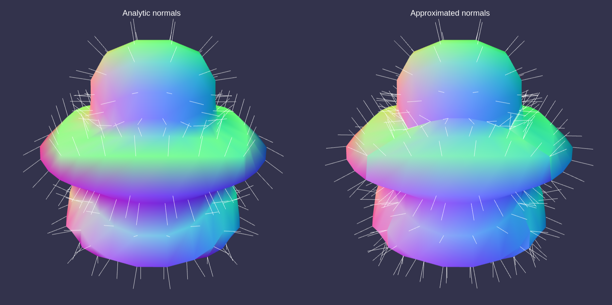

# Analytic Normal Mapping

[](https://github.com/BarthPaleologue/babylonjs-template/actions/workflows/webpack.yml)
[](https://github.com/BarthPaleologue/AnalyticNormal/actions/workflows/deploy.yml)



This repository is a small scale demonstration of the analytic normal mapping technique. 

The theory is based on [this stack exchange post](https://math.stackexchange.com/questions/1071662/surface-normal-to-point-on-displaced-sphere).

This project has been created using **webpack-cli**, you can now run

```
npm run build
```

or

```
yarn build
```

to bundle your application
